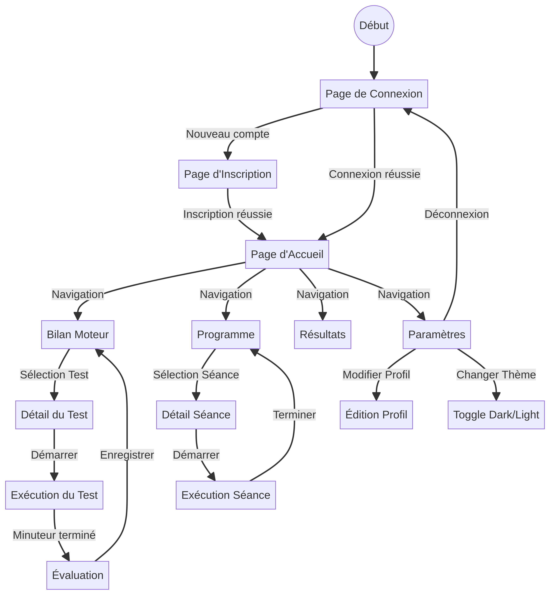

# Documentation Wireframe & User Flow - Projet GENÈSE

## 1. Introduction
Ce document présente l'architecture de l'information et les maquettes fonctionnelles (wireframes) de l'application mobile **GENÈSE**. L'objectif est de définir la structure des écrans, les flux de navigation et les interactions clés pour le développement.

## 2. Flux Utilisateur (User Flow)
Le diagramme ci-dessous illustre le parcours utilisateur principal, de la connexion à la réalisation des tests et au suivi du programme.

---

## 3. Wireframes des Écrans

### 3.1 Écran de Connexion / Inscription
**Objectif** : Authentifier l'utilisateur ou créer un nouveau compte.

*   **Header** : Logo "Aji Tssourte" centré, Titre "GENÈSE", Sous-titre "Reprendre le contrôle de votre corps".
*   **Sélecteur de Mode** : Tabs [Connexion | Inscription].
*   **Formulaire Connexion** :
    *   Champ Email (Input text).
    *   Champ Mot de passe (Input password avec toggle visibilité).
    *   Bouton "Se connecter" (CTA Principal - Orange).
    *   Lien "Pas encore de compte ? S'inscrire".
*   **Formulaire Inscription** :
    *   Champ Nom complet.
    *   Champ Email.
    *   Champ Mot de passe.
    *   Sélecteur Âge (Dropdown 20-30 ans).
    *   Sélecteur Niveau d'activité (Sédentaire, Actif, Sportif).
    *   Bouton "S'inscrire" (CTA Principal).

### 3.2 Écran d'Accueil (Dashboard)
**Objectif** : Vue d'ensemble de la progression et accès rapide.

*   **Header** :
    *   Avatar utilisateur (cercle) à gauche.
    *   Message de bienvenue "Bonjour, [Nom]".
    *   Icône Notification à droite.
*   **Section Hero** :
    *   Image de fond (Garçon salle de sport) avec overlay sombre.
    *   Texte "Bienvenue à GENÈSE".
*   **Cartes de Résumé (Grid 3 colonnes)** :
    *   Carte 1 : Icône "Séances" (Orange), Chiffre (ex: 3), Label "Séances".
    *   Carte 2 : Icône "Jours" (Rose), Chiffre (ex: 5), Label "Jours".
    *   Carte 3 : Icône "Progrès" (Bleu), Chiffre (ex: +15%), Label "Progrès".
*   **Section "Activité Récente"** :
    *   Liste verticale des dernières activités (ex: "Test Mobilité - Complété").
*   **Navigation (Bottom Tab Bar)** :
    *   [Accueil] (Actif).
    *   [Bilan].
    *   [Programme].
    *   [Résultats].
    *   [Paramètres].

### 3.3 Écran Bilan Moteur
**Objectif** : Lister les 8 tests d'évaluation et leur statut.

*   **Header** : Titre "Bilan Moteur".
*   **Barre de Progression Globale** : Barre verte indiquant le nombre de tests complétés (ex: 6/8).
*   **Grille des Tests (Grid 2 colonnes)** :
    *   Chaque carte de test contient :
        *   Icône SVG spécifique (Jambe, Équilibre, etc.).
        *   Titre du test (ex: "Mobilité Hanche").
        *   Indicateur de statut (Check vert si fait, Cercle vide sinon).
        *   Score (si fait) ou Durée (si à faire).
        *   Bouton "Démarrer" (si à faire) ou "Refaire" (si fait).

### 3.4 Écran Détail du Test (Mode Exécution)
**Objectif** : Guider l'utilisateur pendant la réalisation d'un test.

*   **Header Fixe (Top)** :
    *   Bouton Retour (<).
    *   Titre du Test.
    *   **Minuteur (Timer)** : Affichage digital (MM:SS) bien visible.
*   **Contenu Scrollable** :
    *   **Vidéo** : Lecteur vidéo pleine largeur (Fente avant, Squat, etc.).
    *   **Instructions** : Carte avec liste à puces des étapes à suivre.
*   **Barre d'Action Fixe (Bottom)** :
    *   Bouton "Démarrer / Pause" (Large, Orange).
    *   Bouton "Réinitialiser" (Secondaire).
    *   Bouton "Terminer" (Vert) -> Mène à l'écran d'évaluation.

### 3.5 Écran Évaluation (Fin de Test)
**Objectif** : Recueillir le score et les observations de l'utilisateur.

*   **Header** : Titre "Test Terminé !".
*   **Formulaire** :
    *   **Score** : Slider interactif (0 à 10) avec feedback visuel de la valeur.
    *   **Observations** : Zone de texte (Textarea) pour les commentaires.
*   **Footer** :
    *   Bouton "Enregistrer et Quitter" (CTA Principal).

### 3.6 Écran Résultats
**Objectif** : Visualiser l'analyse des performances.

*   **Header** : Titre "Vos Résultats".
*   **Graphique Radar** : Visualisation polygonale des 3 axes (Mobilité, Stabilité, Conscience).
*   **Détail par Catégorie** :
    *   Cartes pour chaque catégorie avec barre de progression colorée.
    *   Score sur 100.
*   **Recommandations** :
    *   Texte généré basé sur les scores faibles (ex: "Focus sur la mobilité de hanche").

### 3.7 Écran Programme
**Objectif** : Afficher le plan d'entraînement personnalisé.

*   **Header** : Titre "Mon Programme".
*   **Sélecteur de Semaine** : Tabs [Semaine 1 | Semaine 2 | ...].
*   **Liste des Séances** :
    *   Cartes accordéon pour chaque séance (Jour 1, Jour 2...).
    *   Détail : Liste des exercices, durée, répétitions.
    *   Bouton "Lancer la séance".

### 3.8 Écran Paramètres
**Objectif** : Gérer le compte et les préférences.

*   **Header** : Titre "Paramètres".
*   **Section Profil** : Avatar, Nom, Email (Modifiables).
*   **Section Préférences** :
    *   Toggle "Mode Sombre" (Dark Mode).
    *   Sélecteur Langue (Français / Arabe).
    *   Toggle Notifications.
*   **Footer** :
    *   Bouton "Se déconnecter" (Rouge, avec icône SVG).

---

## 4. Architecture de Navigation
L'application utilise une navigation principale par **Bottom Tab Bar** persistante sur les écrans principaux. Les écrans de détail (Test, Séance) s'ouvrent en **Full Screen Modal** ou en navigation empilée (Stack) pour focaliser l'attention de l'utilisateur.

*   **Tab 1 : Accueil** (Dashboard)
*   **Tab 2 : Bilan** -> Test Detail -> Évaluation
*   **Tab 3 : Programme** -> Séance Detail
*   **Tab 4 : Résultats**
*   **Tab 5 : Paramètres**
